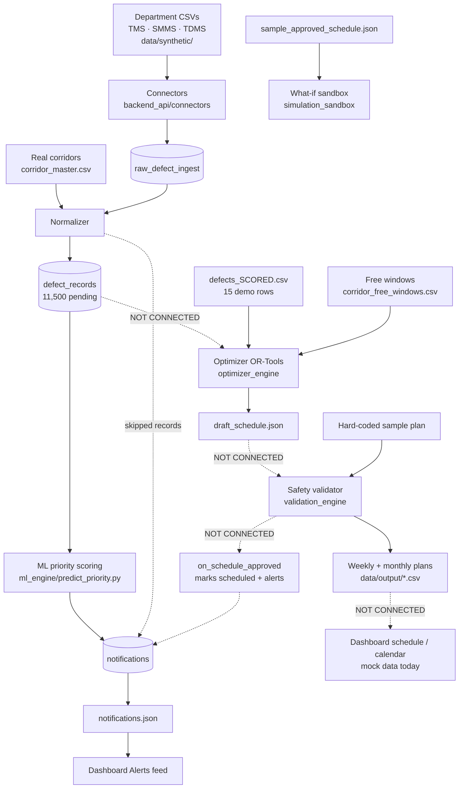

# RailOpt — Execution Flow Roadmap

How the project actually runs: what starts each stage, what it reads, what
it produces, and who picks that up next. It then shows where the flow is
broken today, and the order to connect it into one run.

Everything here was checked by running each stage on the current `main`.
Ownership follows the "Who owns what" table in [CONTRACTS.md](CONTRACTS.md).
Features are explained in [ROADMAP.md](ROADMAP.md).

---

## 1. The flow in one picture

Solid arrows are connected in code today. Dashed arrows are hand-offs that
still happen through fixed files or sample data, or not at all.



**In one sentence:** the left side (defects → database → scores → alerts →
dashboard) runs for real on all 11,500 records. The right side (optimizer →
validator → plans → sandbox) works, but each stage runs on its own sample
input, not on the previous stage's output.

---

## 2. Run the whole project today, in order

Run from the repo root. Each stage runs alone; nothing runs the next one
for you.

| # | Stage | Command | Takes | What you should see |
|---|---|---|---|---|
| 1 | Backend: ingest, normalize, score, alert | `cd backend_api` then `python run_pipeline.py` | ~3 s | `raw_defect_ingest total: 11500`, `620` notifications (`0 new` on re-runs) |
| 2 | Backend check | `python backend_api/test_pipeline.py` | ~5 s | `OK: backend pipeline, notifications and scorer checks passed` |
| 3 | Optimizer | `cd optimizer_engine` then `python run_optimizer.py` | ~4 s | `Loaded 15 prioritized tasks across 8 corridors`, 4 blocks, writes `output/draft_schedule.json` |
| 4 | Validator tests | `cd validation_engine` then `python -m pytest -q test_safety.py` | <1 s | `4 passed` |
| 5 | Weekly + monthly plans | `cd validation_engine` then `python multi_horizon.py` | <1 s | Weekly passes on attempt 2 (overlap fixed), monthly on attempt 1; writes `data/output/*_block_plan.csv` |
| 6 | What-if sandbox | `cd simulation_sandbox` then `python what_if_sandbox.py` | <1 s | Scenario A `PASS`, scenario B `FAIL`, original schedule untouched |
| 7 | Dashboard | `cd dashboard` then `npm run dev` | — | http://localhost:5173. Alerts come from stage 1, and the rest is mock data |

Install once first: `pip install -r requirements.txt` (plus `pytest` for
stage 4). Steps 1, 3 and 5 rewrite files that are committed
(`notifications.json`, `draft_schedule.json`, the plan CSVs). Only commit
those when their content has actually changed.

---

## 3. Stage by stage

Each stage: **what starts it → what it reads → what happens → what it
writes → who uses that → is the next hand-off connected?**

### Stage 1–3 · Ingest, store, normalize (Person 2, `backend_api/`)
- **Started by:** `run_pipeline.py`, steps 0–5.
- **Reads:**
  - the three department CSVs in `data/synthetic/`
  - `data/derived/corridor_master.csv`
- **What happens:**
  1. The schema is applied.
  2. 8,622 corridors are loaded.
  3. Each connector copies its rows untouched into `raw_defect_ingest`.
  4. The normalizer converts them into one standard shape in
     `defect_records`, with `status = pending`.
  5. Rows it can't place raise `RECORD_SKIPPED`.
- **Writes:** `backend_api/db/railway.db`.
- **Used by:** `get_pending_defects()`.
- **Next hand-off:** ✅ connected (the pipeline calls the scorer).

### Stage 4 · ML priority scoring (Person 1, `ml_engine/`)
- **Started by:** `run_pipeline.py` step 6.
  - It can also run alone: `python ml_engine/predict_priority.py <file.csv>`
    writes `<file>_SCORED.csv`.
- **Reads:** pending defects from the database.
- **What happens:**
  1. All 11,500 records are scored in one batch (~0.1 s).
  2. Each record gets a failure probability, a score from 0 to 100 (plus
     15 for Class A, 5 for Class B), an explanation and a `needs_review`
     flag.
  3. Records at 99.5% probability or above (310 today) become
     `HIGH_PRIORITY_DEFECT` alerts, sent to the Controller and to the
     department.
- **Writes:** the `notifications` table, then `dashboard/public/notifications.json`.
- **Used by:** the dashboard's Alerts feed.
- **Next hand-off:**
  - ✅ connected to alerts.
  - ❌ **not connected to the optimizer.** The ranked list stays inside the
    pipeline run and is never handed on.

### Stage 5–6 · Free windows + optimizer (Person 1, `optimizer_engine/`)
- **Started by:** `run_optimizer.py`.
- **Reads:**
  - `data/synthetic/defects_SCORED.csv`: **15 hand-made demo rows**, not
    the database.
  - `data/derived/corridor_free_windows.csv` (273k rows of real
    timetable gaps).
- **What happens:**
  1. The capacity engine looks up each corridor's free windows.
  2. The demo corridor IDs (`COR-01` …) don't exist in the real data, so
     it falls back to 3 default windows: 09:30 (3 h), 13:00 (2.5 h) and
     23:00 (4 h).
  3. For each corridor, OR-Tools CP-SAT picks which tasks go in which
     window. It maximises priority × 10 minus 300 for every window opened.
- **Writes:** `optimizer_engine/output/draft_schedule.json`.
- **Used by:** nothing yet. The validator doesn't read this file.
- **What today's run actually does:** 15 tasks in, **4 blocks out, merge
  ratio 1.0 : 1**. No requests are combined, because:
  - tasks scoring under 30 are never worth the 300-point cost of a window
  - tasks of 5–6 hours don't fit any fallback window
  - no two tasks on a corridor fit in the same window together

  The **3.2 : 1** on the dashboard is mock data, not this output.
- **Next hand-off:** ❌ not connected. The validator also expects one row
  per task, not per block (CONTRACTS.md Interface 4).

### Stage 7–8 · Safety validation + weekly/monthly plans (Person 3, `validation_engine/`)
- **Started by:**
  - `multi_horizon.py`, for the plans
  - `test_safety.py`, for the rule tests
- **Reads:** a plan **hard-coded in `multi_horizon.py`** (`CORRIDOR_NORTH`,
  `TASK_W01`, …), not the optimizer's draft.
- **What happens:**
  1. `SafetyRuleEngine.run_validation()` checks three rules: track overlap,
     15-minute train headway, and power-zone conflicts.
  2. On FAIL, the violations become "cuts".
  3. In standalone mode, it fixes the plan itself (shifts the clashing task)
     and retries, up to 3 times.
- **Writes:** `validation_engine/data/output/weekly_tactical_block_plan.csv`
  and `monthly_strategic_block_plan.csv`.
- **Used by:** nothing yet.
- **Next hand-off:** ❌ not connected. It doesn't call `on_schedule_approved()`,
  so no defect is ever marked `scheduled` and no `BLOCK_ASSIGNED` or
  `VALIDATION_FAIL` alert is raised. The dashboard doesn't read the plans
  either.

### Stage 9 · Dashboard (Person 4, `dashboard/`)
- **Started by:** `npm run dev`. The built copy in `dashboard/dist/` is
  what's deployed.
- **Reads:**
  - `public/notifications.json` (real, from stage 4)
  - `allCorridors.json` (real corridors)
  - `mockData.js` (everything else)
- **Shows:** alerts and corridors from real data. The summary cards,
  schedule, calendar and decision trace are **mock data**.

### Stage 10 · What-if sandbox (Person 1, `simulation_sandbox/`)
- **Started by:**
  - `what_if_sandbox.py`
  - or opening `what_if_sandbox.html`, the interactive demo
- **Reads:** `sample_approved_schedule.json` (hand-written).
- **What happens:** it moves one block on a copy of the schedule,
  re-checks just that corridor with its own rule subset, and reports
  PASS/FAIL plus the change in downtime. The original is never changed.
- **Next hand-off:** ❌ it doesn't read stage 8's plans or call the real
  validator. The point where the real validator plugs in is marked
  `_validate_corridor`.

---

## 4. Follow one defect through the system

`TMS000025`: a Class A broken rail, 1,487 days overdue, on corridor
`COR01757` (Bayana Jn → Dumariya).

| Step | What happens to it today | Status |
|---|---|---|
| Ingest | Copied from the TMS CSV into `raw_defect_ingest`, with its original row kept | ✅ |
| Normalize | Becomes a standard `defect_records` row: severity 3, traffic 43, `pending` | ✅ |
| Score | 100% failure probability, final score 100, top of the ranked list | ✅ |
| Alert | `HIGH_PRIORITY_DEFECT` to the Controller and to Engineering; visible in the dashboard feed | ✅ |
| Optimize | **Never seen.** The optimizer reads the 15 demo rows instead | ❌ |
| Validate | Not reached | ❌ |
| Approve | Not reached, so it stays `pending` forever | ❌ |
| Crew told | Not reached, so there's no `BLOCK_ASSIGNED` alert | ❌ |

The most urgent defect in the data is flagged loudly, but never gets
scheduled. Section 6 fixes that.

---

## 5. Where the flow breaks, and who owns each fix

| # | Break | Owner | Fix |
|---|---|---|---|
| 1 | Optimizer reads a demo CSV, not the database | Person 1 | Load with `score_all_pending_tasks(get_pending_defects())`; take the top N per horizon |
| 2 | Optimizer can't place long or low-score tasks, and never merges on the fallback windows | Person 1 | Feeding real corridors (break 1) gives real windows. Then tune the 300-point window penalty against task priorities |
| 3 | Optimizer output shape ≠ validator input | Person 1 | Adapter: each block → one row per task (CONTRACTS.md Interface 4) |
| 4 | Validator runs on a hard-coded plan | Person 3 | `multi_horizon.py` reads the adapted draft instead of its sample |
| 5 | Validation result goes nowhere | Person 3 | Call `on_schedule_approved(report, schedule)` on PASS and on FAIL |
| 6 | Plans never reach the dashboard | Person 4 | Dashboard reads the weekly/monthly plan (CSV or a JSON export) instead of mock schedule data |
| 7 | Sandbox uses its own sample and rules | Person 1 | Read the approved plan; swap `_validate_corridor` for the real validator |
| 8 | Block requests (COA) aren't loaded | Person 2 | COA connector, so department requests enter the same flow |

---

## 6. Execution roadmap: connect it into one run

Do the steps in order; each one unlocks the next. After each, re-run the
flow from section 2 and check the "done when" line.

**Step A: Feed the optimizer from the database** (Person 1; breaks 1–2)
- **Change:** the optimizer's loader calls
  `score_all_pending_tasks(get_pending_defects())` and keeps the top N
  per corridor.
- **Done when:** `run_optimizer.py` reports real corridor IDs, uses real
  free windows, and at least one block has `merged_count > 1`.

**Step B: Hand the draft to the validator** (Person 1 + Person 3; breaks 3–4)
- **Change:**
  1. Add an adapter that turns each block into one row per task.
  2. Make `multi_horizon.py` read the draft, not its hard-coded sample.
  3. Fix the block fields: real station codes, date rollover past
     midnight, `block_type`, `status: DRAFT`.
- **Done when:** the weekly plan CSV contains real `record_id`s from
  step A.

**Step C: Close the loop back to the database** (Person 3; break 5)
- **Change:** after each validation, call `on_schedule_approved()`.
- **Done when:** defects in a passed plan show `scheduled`; each
  department in a shared block has a `BLOCK_ASSIGNED` alert; a failed plan
  raises `VALIDATION_FAIL` and marks nothing.

**Step D: Show the real plan** (Person 4 + Person 1; breaks 6–7)
- **Change:**
  - The dashboard's schedule, calendar and summary numbers come from the
    plan.
  - The sandbox loads the approved plan and uses the real validator.
- **Done when:** the merge ratio on the dashboard equals what step A
  actually produced, and moving a block in the sandbox is checked by
  Layer 7.

**Step E: One command for the whole flow** (Person 2; break 8)
- **Change:**
  1. Add the COA connector.
  2. Add one entry script that runs stages 1 → 8 in order and stops at
     the first failure.
- **Done when:** a single command takes the CSVs to a validated weekly
  plan, with alerts, and running it twice changes nothing.

**Target flow after step E:**
```
CSVs ─► database ─► scores ─► optimizer ─► validator ─┬─ PASS ─► defects scheduled + teams alerted ─► dashboard
                                   ▲                  └─ FAIL ─► cuts ───────────┐
                                   └─────────────────────────────────────────────┘
```
After that, the officer workflow and the public API (ROADMAP.md Phase 2,
`backend_api/API_ROADMAP.md` in PR #8) sit on top of this one connected
flow.

---

## 7. Not on `main` yet

These are open PRs on the fork. They don't change the flow above.
- **#4:** backend notes, onboarding guide, backend roadmap
- **#5:** UI wireframes
- **#6:** the new `control-desk/` UI (sample data)
- **#7:** simpler, bilingual dashboard summary cards
- **#8:** public API roadmap
